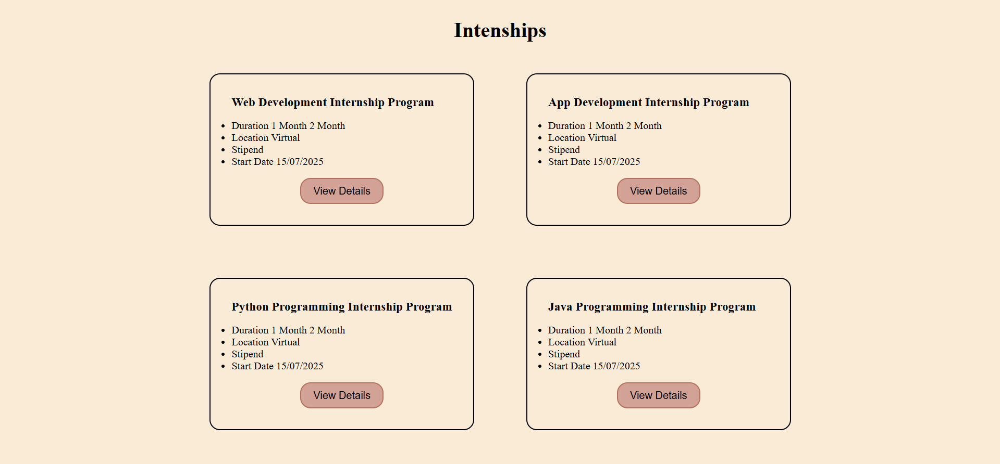

# VaultOfCodes_Task_2

# Task Description:

Recreate the internship listing page from VaultofCodes with a modern and visually appealing layout using only HTML and CSS. Focus on design and interactivity of the internship cards.

# Project Overview:

Title: Internship Listings Page

Tools Used: HTML5, CSS3

Responsive: yes

# Objective:

Replicate the layout of the internship cards (Web, App, Python, Java).

Make it visually attractive and user-friendly.

Use only HTML and CSS (no JavaScript required).

Buttons should be functional.

# Features:

Clean and modern UI

Internship details arranged in card layout

Consistent spacing and alignment

Fonts and colors close to the original style

# Preview:

